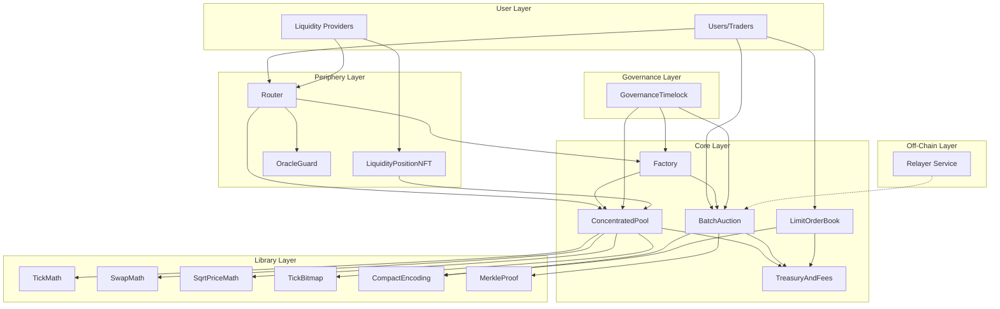
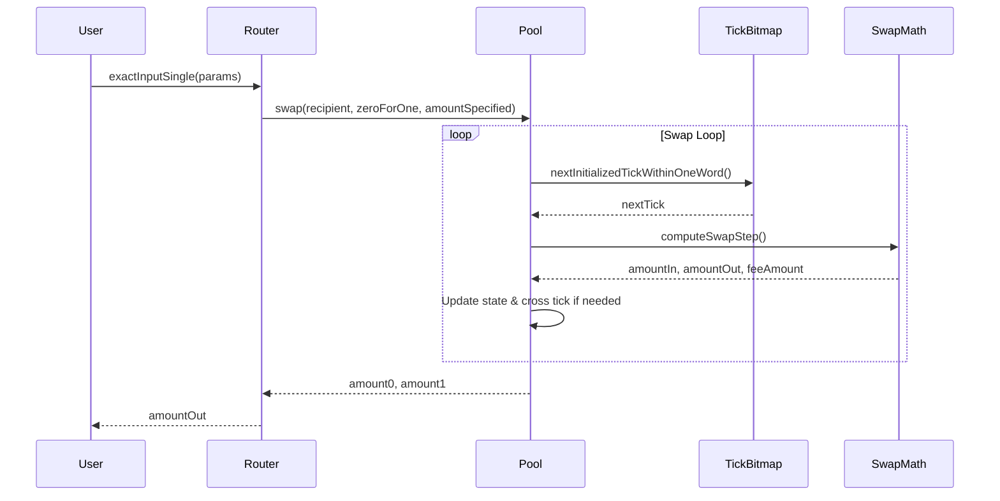
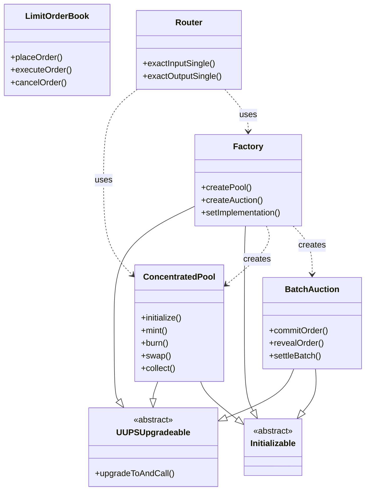

# SupaDao Hybrid DEX

A fully functional, decentralized exchange combining concentrated liquidity AMM with discrete sealed-batch auctions for MEV resistance.

## Table of Contents

- [Executive Summary](#executive-summary)
- [Architecture Overview](#architecture-overview)
- [Core Contracts](#core-contracts)
- [Libraries](#libraries)
- [Periphery Contracts](#periphery-contracts)
- [Setup & Deployment](#setup--deployment)
- [Usage Examples](#usage-examples)
- [Security](#security)
- [Gas Benchmarks](#gas-benchmarks)
- [Documentation](#documentation)
- [Contributing](#contributing)

## Executive Summary

This DEX design is unique because it combines two complementary mechanisms:

- **Concentrated Liquidity AMM**: Capital-efficient market making with tick-based liquidity similar to Uniswap V3
- **Batch Auctions**: MEV-resistant limit orders through commit-reveal scheme with discrete settlement batches
- **Limit Order Book**: Gas-optimized on-chain order book with compact encoding

The system is designed for scalability with:

- Tick bitmap for O(1) tick traversal
- Calldata compression for rollup optimization
- CREATE2 deterministic pool addresses
- Minimal on-chain state for orders
- UUPS upgradeability for all core contracts

## Architecture Overview

### System Architecture



### Component Interaction Flow



### Contract Hierarchy



## Core Contracts

### Factory.sol

**Purpose**: Central factory for deploying pools and auctions with UUPS upgradeability.

**Key Features**:

- CREATE2 deterministic addresses for pools
- UUPS proxy pattern for upgradeability
- Manages implementation contracts
- Fee tier configuration (500, 3000, 10000 bps)
- Tick spacing per fee tier

**Main Functions**:

```solidity
function createPool(address tokenA, address tokenB, uint24 fee) external returns (address pool)
function createAuction(address tokenA, address tokenB) external returns (address auction)
function setImplementation(bytes32 contractType, address implementation) external
```

**Events**:

- `PoolCreated(address indexed token0, address indexed token1, uint24 fee, int24 tickSpacing, address pool)`
- `AuctionCreated(address indexed token0, address indexed token1, address auction)`

---

### ConcentratedPool.sol

**Purpose**: Concentrated liquidity AMM with tick-based liquidity provision.

**Key Features**:

- **Tick Bitmap**: O(1) next-tick lookup using bitmap storage
- **Fee Growth Tracking**: Per-position fee accounting with Q128.128 precision
- **Multi-tick Swaps**: Complete swap logic with tick crossing
- **Position Management**: NFT-compatible position tracking
- **Protocol Fees**: Configurable protocol fee extraction

**Main Functions**:

```solidity
function initialize(uint160 sqrtPriceX96) external
function mint(address recipient, int24 tickLower, int24 tickUpper, uint128 amount, bytes calldata data) external returns (uint256 amount0, uint256 amount1)
function burn(int24 tickLower, int24 tickUpper, uint128 amount) external returns (uint256 amount0, uint256 amount1)
function swap(address recipient, bool zeroForOne, int256 amountSpecified, uint160 sqrtPriceLimitX96, bytes calldata data) external returns (int256 amount0, int256 amount1)
function collect(address recipient, int24 tickLower, int24 tickUpper, uint128 amount0Requested, uint128 amount1Requested) external returns (uint128 amount0, uint128 amount1)
```

**State Variables**:

- `slot0`: Current price, tick, and protocol fees
- `liquidity`: Current active liquidity
- `feeGrowthGlobal0X128`, `feeGrowthGlobal1X128`: Global fee accumulators
- `positions`: Mapping of position data
- `ticks`: Mapping of tick data

---

### BatchAuction.sol

**Purpose**: Sealed-bid batch auction with commit-reveal and merkle proof settlement.

**Key Features**:

- **Commit-Reveal Scheme**: Prevents front-running
- **Batch Settlement**: Orders matched at discrete intervals
- **Merkle Proofs**: Off-chain aggregation, on-chain verification
- **Uniform Price Clearing**: Fair price discovery
- **Relayer System**: Authorized relayers settle batches

**Main Functions**:

```solidity
function commitOrder(bytes32 commitment) external
function commitOrderWithLock(bytes32 commitment, uint256 amount, bool isBuyOrder) external
function revealOrder(Order calldata order, bytes32 salt) external
function settleBatchWithProof(uint256 batchId, Settlement calldata settlement) external
function getBatchState(uint256 batchId) external view returns (BatchState)
```

**Batch States**:

- `Open`: Accepting commitments
- `Revealing`: Accepting reveals
- `Settled`: Batch settled

---

### LimitOrderBook.sol

**Purpose**: Gas-optimized on-chain limit order book with compact encoding.

**Key Features**:

- **Compact Encoding**: Minimizes calldata costs
- **Maker/Taker Model**: Makers place orders, takers execute
- **Partial Fills**: Optional partial order execution
- **Order Cancellation**: Makers can cancel unfilled orders
- **Fee Collection**: Protocol fees on each trade

**Main Functions**:

```solidity
function placeOrder(uint128 amount, uint128 limitPrice, uint8 side, uint64 expiry, bool partialFillAllowed) external returns (bytes32 orderHash)
function placeOrderCompact(bytes calldata compactOrderData, bool partialFillAllowed) external returns (bytes32 orderHash)
function executeOrder(bytes32 orderHash, uint128 takerAmount) external returns (ExecutionResult memory)
function cancelOrder(bytes32 orderHash) external
function batchExecuteOrders(bytes32[] calldata orderHashes, uint128[] calldata takerAmounts) external returns (ExecutionResult[] memory)
```

## Libraries

### TickMathOptimized.sol

Tick ↔ Price conversions with bit manipulation optimizations:

```solidity
function getSqrtRatioAtTick(int24 tick) internal pure returns (uint160 sqrtPriceX96)
function getTickAtSqrtRatio(uint160 sqrtPriceX96) internal pure returns (int24 tick)
```

**Price Formula**: `price = 1.0001^tick`

---

### SwapMath.sol

Swap step computation with fee handling:

```solidity
function computeSwapStep(
    uint160 sqrtRatioCurrentX96,
    uint160 sqrtRatioTargetX96,
    uint128 liquidity,
    int256 amountRemaining,
    uint24 feePips
) internal pure returns (
    uint160 sqrtRatioNextX96,
    uint256 amountIn,
    uint256 amountOut,
    uint256 feeAmount
)
```

---

### SqrtPriceMath.sol

Price and amount calculations:

```solidity
function getNextSqrtPriceFromAmount0RoundingUp(uint160 sqrtPX96, uint128 liquidity, uint256 amount, bool add) internal pure returns (uint160)
function getNextSqrtPriceFromAmount1RoundingDown(uint160 sqrtPX96, uint128 liquidity, uint256 amount, bool add) internal pure returns (uint160)
function getAmount0Delta(uint160 sqrtRatioAX96, uint160 sqrtRatioBX96, uint128 liquidity, bool roundUp) internal pure returns (uint256)
function getAmount1Delta(uint160 sqrtRatioAX96, uint160 sqrtRatioBX96, uint128 liquidity, bool roundUp) internal pure returns (uint256)
```

---

### TickBitmap.sol

Efficient tick traversal using bitmap compression:

```solidity
function flipTick(mapping(int16 => uint256) storage self, int24 tick, int24 tickSpacing) internal
function nextInitializedTickWithinOneWord(mapping(int16 => uint256) storage self, int24 tick, int24 tickSpacing, bool lte) internal view returns (int24 next, bool initialized)
```

**Optimization**: 256 ticks per word for O(1) lookup.

---

### CompactEncoding.sol

Calldata compression for orders:

```solidity
function packOrder(CompactOrder memory order) internal pure returns (bytes memory)
function unpackOrder(bytes calldata packed) internal pure returns (CompactOrder memory)
function hashOrder(CompactOrder memory order, bytes32 salt) internal pure returns (bytes32)
```

**Gas Savings**: ~40% reduction in calldata costs.

---

### MerkleProof.sol

Merkle tree verification:

```solidity
function verify(bytes32[] memory proof, bytes32 root, bytes32 leaf) internal pure returns (bool)
function computeRoot(bytes32[] memory leaves) internal pure returns (bytes32)
```

## Periphery Contracts

### Router.sol

Swap routing with slippage protection:

```solidity
function exactInputSingle(ExactInputSingleParams calldata params) external payable returns (uint256 amountOut)
function exactOutputSingle(ExactOutputSingleParams calldata params) external payable returns (uint256 amountIn)
```

**Features**:

- Deadline protection
- Slippage limits
- Multi-hop routing (planned)

---

### OracleGuard.sol

Price manipulation protection:

```solidity
function checkPriceDeviation(address pool, uint160 sqrtPriceX96, uint32 twapPeriod, uint16 maxDeviationBps) external view
```

**Protection**: TWAP deviation checks prevent oracle manipulation.

---

### LiquidityPositionNFT.sol

NFT representation of liquidity positions:

```solidity
function mint(address to, uint256 tokenId) external
function burn(uint256 tokenId) external
function positions(uint256 tokenId) external view returns (Position memory)
```

## Setup & Deployment

### Prerequisites

```bash
# Install Foundry
curl -L https://foundry.paradigm.xyz | bash
foundryup

# Install Node.js (for relayer)
# Install from https://nodejs.org/
```

### Installation

```bash
git clone <repo>
cd dex
forge install
```

### Compilation

```bash
forge build
```

### Testing

```bash
# Run all tests
forge test

# Run with gas report
forge test --gas-report

# Run fuzz tests
forge test --match-path test/*Fuzz* -vvv

# Run invariant tests
forge test --match-path test/*Invariant* -vvv

# Generate coverage
forge coverage
```

### Deployment

#### Local (Anvil)

```bash
# Terminal 1: Start Anvil
anvil

# Terminal 2: Deploy contracts
forge script script/DeployAll.s.sol \
  --broadcast \
  --rpc-url http://localhost:8545

# Verify deployment
cat deployments/localhost.json
```

#### Testnet (Sepolia)

```bash
# Set environment variables
export PRIVATE_KEY=0x...
export SEPOLIA_RPC_URL=https://...
export ETHERSCAN_API_KEY=...

# Deploy
forge script script/DeployAll.s.sol \
  --broadcast \
  --rpc-url $SEPOLIA_RPC_URL \
  --private-key $PRIVATE_KEY \
  --verify \
  --etherscan-api-key $ETHERSCAN_API_KEY

# Generate verification commands
forge script script/Verify.s.sol --rpc-url $SEPOLIA_RPC_URL
```

#### Mainnet

> [!CAUTION]
> Mainnet deployment requires:
>
> - Professional security audit
> - Multisig for admin roles
> - Timelock for upgrades
> - Comprehensive testing on testnet

```bash
forge script script/DeployAll.s.sol \
  --broadcast \
  --rpc-url $MAINNET_RPC_URL \
  --private-key $DEPLOYER_PRIVATE_KEY \
  --verify \
  --etherscan-api-key $ETHERSCAN_API_KEY
```

### Post-Deployment

1. **Verify Contracts**: Run `forge script script/Verify.s.sol`
2. **Grant Roles**: Assign RELAYER_ROLE, UPGRADER_ROLE
3. **Setup Relayer**: Configure and start relayer service
4. **Create Initial Pools**: Deploy major trading pairs
5. **Monitor**: Set up monitoring and alerting

## Usage Examples

### Creating a Pool

```solidity
import {Factory} from "./contracts/core/Factory.sol";

Factory factory = Factory(FACTORY_ADDRESS);

// Create WETH/USDC pool with 0.3% fee
address pool = factory.createPool(
    WETH_ADDRESS,
    USDC_ADDRESS,
    3000  // 0.3% = 3000 basis points
);
```

### Initializing a Pool

```solidity
import {ConcentratedPool} from "./contracts/core/ConcentratedPool.sol";

ConcentratedPool pool = ConcentratedPool(POOL_ADDRESS);

// Initialize at 1:1 price (for tokens with same decimals)
uint160 sqrtPriceX96 = 79228162514264337593543950336;
pool.initialize(sqrtPriceX96);
```

**Price Calculation**:

```
sqrtPriceX96 = sqrt(price) * 2^96
For 1:1 price: sqrt(1) * 2^96 = 79228162514264337593543950336
For 1500 USDC/ETH: sqrt(1500) * 2^96 ≈ 3.07e21
```

### Adding Liquidity

```solidity
import {IERC20} from "@openzeppelin/contracts/token/ERC20/IERC20.sol";

// Approve tokens
IERC20(token0).approve(address(pool), type(uint256).max);
IERC20(token1).approve(address(pool), type(uint256).max);

// Add liquidity in range [-1000, 1000] ticks
int24 tickLower = -1000;
int24 tickUpper = 1000;
uint128 liquidity = 100 ether;

(uint256 amount0, uint256 amount1) = pool.mint(
    msg.sender,      // recipient
    tickLower,       // lower tick
    tickUpper,       // upper tick
    liquidity,       // liquidity amount
    ""               // callback data
);
```

### Swapping Tokens

```solidity
import {Router} from "./contracts/periphery/Router.sol";

Router router = Router(ROUTER_ADDRESS);

// Approve router
token0.approve(address(router), amountIn);

// Execute swap
uint256 amountOut = router.exactInputSingle(
    Router.ExactInputSingleParams({
        tokenIn: address(token0),
        tokenOut: address(token1),
        fee: 3000,
        recipient: msg.sender,
        amountIn: 1 ether,
        amountOutMinimum: 1400e6,  // Minimum 1400 USDC
        sqrtPriceLimitX96: 0       // No price limit
    })
);
```

### Placing Limit Orders

```solidity
import {LimitOrderBook} from "./contracts/core/LimitOrderBook.sol";

LimitOrderBook orderBook = LimitOrderBook(ORDER_BOOK_ADDRESS);

// Approve tokens
token0.approve(address(orderBook), amount);

// Place sell order
bytes32 orderHash = orderBook.placeOrder(
    1 ether,                          // amount
    1500e18,                          // limit price (1500 quote per base)
    1,                                // side: 1 = sell
    uint64(block.timestamp + 1 days), // expiry
    true                              // allow partial fills
);

// Cancel order
orderBook.cancelOrder(orderHash);
```

### Batch Auction Participation

```solidity
import {IBatchAuction} from "./contracts/interfaces/IBatchAuction.sol";
import {CompactEncoding} from "./contracts/libraries/CompactEncoding.sol";

IBatchAuction auction = IBatchAuction(AUCTION_ADDRESS);

// 1. Create order
IBatchAuction.Order memory order = IBatchAuction.Order({
    nonce: 1,
    expiry: uint64(block.timestamp + 3600),
    amount: 100 ether,
    limitPrice: 1500e6,
    side: 0  // 0 = buy, 1 = sell
});

bytes32 salt = keccak256("my-secret-salt");

// 2. Commit order
bytes32 commitment = CompactEncoding.hashOrder(
    CompactEncoding.CompactOrder({
        nonce: order.nonce,
        expiry: order.expiry,
        amount: order.amount,
        limitPrice: order.limitPrice,
        side: order.side
    }),
    salt
);

auction.commitOrderWithLock(commitment, 150000e6, true); // Lock 150k USDC for buy order

// 3. Wait for batch to close (e.g., 10 blocks)

// 4. Reveal order
auction.revealOrder(order, salt);

// 5. Relayer settles batch automatically
```

## Security

### Threat Model

| Threat              | Mitigation                                                     |
| ------------------- | -------------------------------------------------------------- |
| MEV/Front-running   | Batch auctions with commit-reveal; AMM has slippage protection |
| Oracle Manipulation | OracleGuard with TWAP checks and deviation bounds              |
| Reentrancy          | ReentrancyGuard on all state-changing functions                |
| Integer Overflow    | Solidity 0.8+ automatic checks; explicit bounds                |
| Admin Abuse         | Timelock + multisig for critical operations                    |
| Flash Loan Attacks  | Proper accounting; no spot balance reliance                    |
| Upgrade Risks       | UUPS with timelock; storage layout validation                  |

### Access Control

| Role               | Contracts                | Permissions                           |
| ------------------ | ------------------------ | ------------------------------------- |
| DEFAULT_ADMIN_ROLE | All                      | Grant/revoke roles, update parameters |
| UPGRADER_ROLE      | Factory, Pools, Auctions | Upgrade implementations               |
| RELAYER_ROLE       | BatchAuction             | Settle batches                        |
| PAUSER_ROLE        | BatchAuction             | Emergency pause                       |
| FEE_COLLECTOR_ROLE | LimitOrderBook           | Collect protocol fees                 |

### Audit Checklist

- [x] Static analysis (Slither)
- [x] Fuzz testing (Foundry)
- [x] Invariant testing
- [x] Fork testing against mainnet
- [x] Reentrancy protection verified
- [x] Integer overflow checks
- [x] Access control matrix reviewed
- [ ] External security audit
- [ ] Bug bounty program
- [ ] Formal verification (optional)

### Running Security Tools

```bash
# Slither
pip install slither-analyzer
slither . --exclude-dependencies

# Mythril
pip install mythril
myth analyze contracts/core/ConcentratedPool.sol --execution-timeout 300

# Echidna (property-based testing)
echidna-test . --contract ConcentratedPoolInvariant --config echidna.yaml
```

## Gas Benchmarks

| Operation                | Gas Cost                | Notes                    |
| ------------------------ | ----------------------- | ------------------------ |
| Initialize Pool          | ~16,000                 | One-time cost            |
| Mint (new position)      | ~295,000                | First LP in tick range   |
| Mint (existing position) | ~180,000                | Adding to existing range |
| Swap (no tick cross)     | ~120,000                | Within single tick       |
| Swap (1 tick cross)      | ~180,000                | Crossing one tick        |
| Swap (multiple crosses)  | ~180,000 + 60,000/tick  | Each additional tick     |
| Burn                     | ~150,000                | Remove liquidity         |
| Collect Fees             | ~80,000                 | Claim accumulated fees   |
| Limit Order (place)      | ~180,000                | On-chain order book      |
| Limit Order (execute)    | ~150,000                | Taker execution          |
| Batch Commit             | ~50,000                 | Commit to auction        |
| Batch Reveal             | ~80,000                 | Reveal order             |
| Batch Settlement         | ~200,000 + 50,000/order | Relayer settlement       |

_Benchmarks with `via_ir=true` and 200 optimizer runs on Ethereum mainnet_

## Documentation

- **[SPEC.md](./SPEC.md)**: Complete technical specification
- **[ARCHITECTURE.md](./ARCHITECTURE.md)**: Deep dive into system architecture
- **[CONTRIBUTING.md](./CONTRIBUTING.md)**: Developer contribution guide
- **[SECURITY.md](./SECURITY.md)**: Security model and disclosure
- **[docs/](./docs/)**: API documentation and guides
- **[examples/](./examples/)**: Integration examples

### Quick Links

- [API Reference](./docs/index.md)
- [Integration Guide](./docs/guides/integration.md)
- [Deployment Guide](./docs/guides/deployment.md)
- [Relayer Setup](./script/relayer/README.md)

## Roadmap

### V1 (Current) ✅

- [x] Concentrated liquidity AMM
- [x] Batch auctions with commit-reveal
- [x] Limit order book
- [x] Router and periphery contracts
- [x] UUPS upgradeability
- [x] Relayer system
- [x] Comprehensive testing suite

### V2 (Planned)

- [ ] Flash loans
- [ ] TWAP oracle integration
- [ ] Multi-hop routing optimization
- [ ] Governance token
- [ ] Liquidity mining
- [ ] Cross-chain bridges

### V3 (Future)

- [ ] Layer 2 deployment (Arbitrum, Optimism)
- [ ] Cross-chain liquidity aggregation
- [ ] Advanced order types (stop-loss, OCO)
- [ ] MEV auction integration
- [ ] Concentrated liquidity v2 improvements

## Contributing

We welcome contributions! Please see [CONTRIBUTING.md](./CONTRIBUTING.md) for:

- Development setup
- Code style guide
- Testing requirements
- Pull request process
- Release procedures

## License

MIT License - see [LICENSE](./LICENSE) for details

## Support

- **Documentation**: [docs.hybriddex.io](https://docs.hybriddex.io)
- **Discord**: [discord.gg/hybriddex](https://discord.gg/hybriddex)
- **Twitter**: [@HybridDEX](https://twitter.com/HybridDEX)
- **Email**: support@hybriddex.io

## Acknowledgments

Built with:

- [Foundry](https://github.com/foundry-rs/foundry) - Development framework
- [OpenZeppelin](https://openzeppelin.com/) - Security libraries
- [Uniswap V3](https://uniswap.org/) - Concentrated liquidity inspiration
